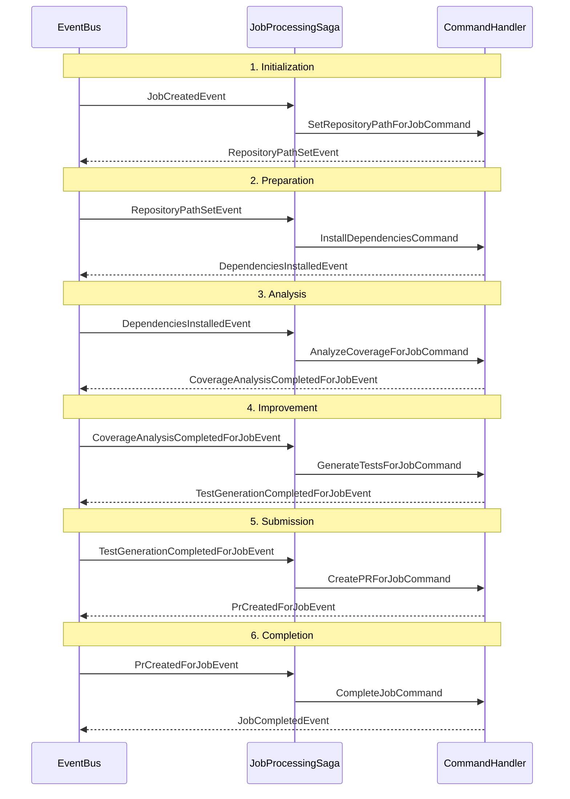
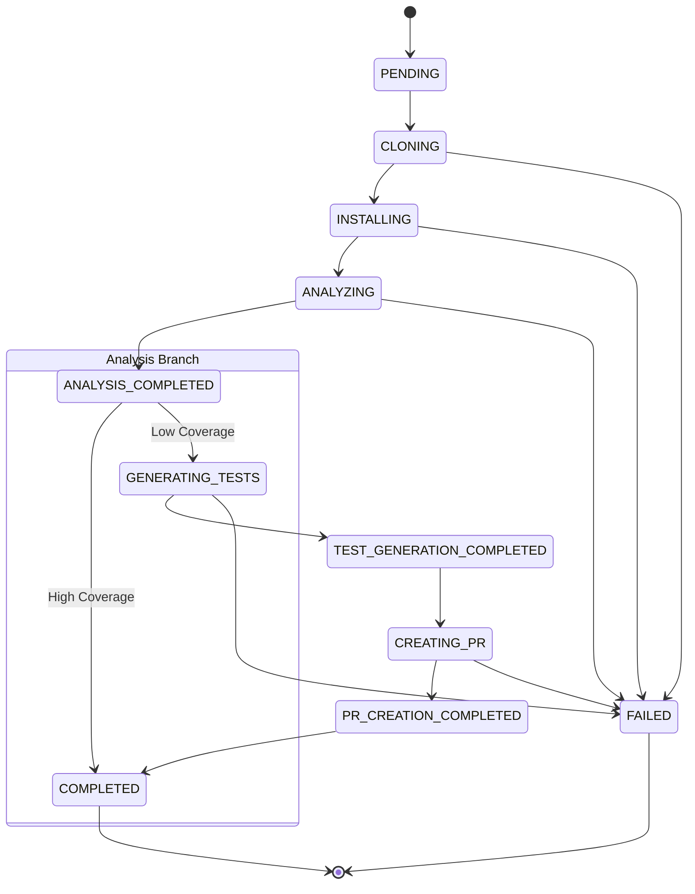

# AI Unit Tests Generator

A full-stack application that automatically improves TypeScript test coverage in GitHub repositories using AI.

## 📚 Documentation Links

- [Backend Documentation](./backend/README.md) - Setup, API, and Architecture details.
- [Frontend Documentation](./frontend/README.md) - Dashboard setup and usage.

## 🧠 Domain Glossary

| Term | Definition |
| :--- | :--- |
| **Job** | The core unit of work. Represents a request to analyze a repository or improve coverage. It tracks the entire lifecycle from cloning to PR creation. |
| **Coverage Analysis** | The process of cloning a repo, installing dependencies, and running tools to calculate test coverage percentage per file. |
| **Test Generation Request** | A specific request to generate unit tests for a single file that has low coverage. |
| **Bounded Context** | A specific boundary within the domain where a particular model is valid and applicable. See below for the specific contexts in this project. |
| **Child Job** | A job that reuses the analysis results of a parent job to generate tests for a different file, skipping expensive cloning and analysis steps. |

## 🏗️ Bounded Contexts

This project follows **Domain-Driven Design (DDD)** principles, organizing the backend into distinct Bounded Contexts. Ideally, these contexts are loosely coupled and communicate via events.

### 1. Job Processing (`bounded-contexts/job-processing`)

**Purpose:** Manages the lifecycle and state of a Job (Pending, Cloning, Completed, Failed).
**Why Chosen:** The concept of a "Job" is central to the application's workflow but is distinct from the specific details of *how* analysis or test generation is performed. It acts as the orchestration layer or state machine.

### 2. Repository Analysis (`bounded-contexts/repository-analysis`)

**Purpose:** Handles all interactions with the existing codebase: cloning git repositories, installing dependencies, and calculating coverage metrics.
**Why Chosen:** This is a distinct problem space concerned with *reading* and *measuring* existing code. It doesn't care about AI or PRs, only about accurate file metrics.

### 3. Test Generation (`bounded-contexts/test-generation`)

**Purpose:** Responsible for the AI-driven improvement loop. It constructs prompts, calls the AI provider (Claude), verifies generated tests, and manages the creation of Pull Requests.
**Why Chosen:** This is the "creative" part of the domain. It has complex logic regarding prompt engineering, AI retry mechanisms, and GitHub API interactions for writing code, which is fundamentally different from static analysis.

## 📡 Domain Events

The system uses an event-driven architecture to decouple Bounded Contexts. Below are the key domain events:

### Job Processing Events

| Event | Purpose |
| :--- | :--- |
| [`JobCreatedEvent`](./backend/src/bounded-contexts/job-processing/domain/events/job-created.event.ts) | Fired when a new job is submitted via the API. |
| [`JobStatusChangedEvent`](./backend/src/bounded-contexts/job-processing/domain/events/job-status-changed.event.ts) | Fired whenever a job transitions to a new state (e.g., PENDING -> CLONING). |
| [`JobCompletedEvent`](./backend/src/bounded-contexts/job-processing/domain/events/job-completed.event.ts) | Fired when a job successfully finishes all required stages. |
| [`JobFailedEvent`](./backend/src/bounded-contexts/job-processing/domain/events/job-failed.event.ts) | Fired when a job encounters a critical error and stops. |
| [`RepositoryPathSetEvent`](./backend/src/bounded-contexts/job-processing/domain/events/repository-path-set.event.ts) | Fired when the repository path is determined/cloned. |
| [`DependenciesInstalledEvent`](./backend/src/bounded-contexts/job-processing/domain/events/dependencies-installed.event.ts) | Fired after `npm install` completes successfully. |
| [`CoverageAnalysisCompletedForJobEvent`](./backend/src/bounded-contexts/job-processing/domain/events/coverage-analysis-completed-for-job.event.ts) | Fired when coverage results are attached to the job. |
| [`TestGenerationCompletedForJobEvent`](./backend/src/bounded-contexts/job-processing/domain/events/test-generation-completed-for-job.event.ts) | Fired when tests are generated and attached to the job. |
| [`PrCreatedForJobEvent`](./backend/src/bounded-contexts/job-processing/domain/events/pr-created-for-job.event.ts) | Fired when a PR is successfully created for the job. |

### Repository Analysis Events

| Event | Purpose |
| :--- | :--- |
| [`GitRepoClonedEvent`](./backend/src/bounded-contexts/git-repo-analysis/domain/events/git-repo-cloned.event.ts) | Fired when `git clone` completes. |
| [`CoverageAnalysisCompletedEvent`](./backend/src/bounded-contexts/git-repo-analysis/domain/events/coverage-analysis-completed.event.ts) | Fired when the coverage tool finishes analysis. |
| [`CoverageAnalysisFailedEvent`](./backend/src/bounded-contexts/git-repo-analysis/domain/events/coverage-analysis-failed.event.ts) | Fired if coverage analysis fails (e.g., build error). |

### Test Generation Events

| Event | Purpose |
| :--- | :--- |
| [`TestGenerationCompletedEvent`](./backend/src/bounded-contexts/test-generation/domain/events/test-generation-completed.event.ts) | Fired when AI successfully generates a test file. |
| [`TestGenerationFailedEvent`](./backend/src/bounded-contexts/test-generation/domain/events/test-generation-failed.event.ts) | Fired if AI fails to generate valid tests after retries. |
| [`PrCreatedEvent`](./backend/src/bounded-contexts/test-generation/domain/events/pr-created.event.ts) | Fired when the GitHub API confirms PR creation. |
| [`PrCreationFailedEvent`](./backend/src/bounded-contexts/test-generation/domain/events/pr-creation-failed.event.ts) | Fired if PR creation fails. |

## 🔄 SAGA Pattern & Event Processing

This project uses the **SAGA Pattern** to manage long-running distributed transactions (the multi-stage job workflow). A Saga is a sequence of local transactions where each transaction updates data within a single service (Bounded Context) and publishes an event to trigger the next step.

### How it Works in This Project

The [`JobProcessingSaga`](./backend/src/bounded-contexts/job-processing/application/sagas/job-processing.saga.ts) acts as the **Orchestrator**. It listens to domain events and decides which Command to execute next. This centralizes the state machine logic in one place while keeping the individual services decoupled.

### Workflow Example

1. **Event:** `JobCreatedEvent`
    - **Saga Action:** Dispatches `SetRepositoryPathForJobCommand`.
2. **Event:** `RepositoryPathSetEvent`
    - **Saga Action:** Dispatches `InstallDependenciesCommand`.
3. **Event:** `DependenciesInstalledEvent`
    - **Saga Action:** Dispatches `AnalyzeCoverageForJobCommand`.
4. **Event:** `CoverageAnalysisCompletedForJobEvent`
    - **Saga Action:** Dispatches `GenerateTestsForJobCommand`.
5. **Event:** `TestGenerationCompletedForJobEvent`
    - **Saga Action:** Dispatches `CreatePRForJobCommand`.
6. **Event:** `PrCreatedForJobEvent`
    - **Saga Action:** Dispatches `CompleteJobCommand`.

## 🚥 Job States

The `Job` entity functions as a state machine, transitioning through the following statuses (defined in `JobStatus` enum):

| Status | Description |
| :--- | :--- |
| `PENDING` | Initial state when a job is created. |
| `CLONING` | The repository is being cloned to the workspace. |
| `INSTALLING` | `npm install` is running to prepare the environment. |
| `ANALYZING` | The coverage tool is calculating metrics (e.g., `vitest coverage`). |
| `ANALYSIS_COMPLETED` | Coverage data has been gathered and saved. |
| `GENERATING_TESTS` | AI is actively generating unit tests for the target file. |
| `TEST_GENERATION_COMPLETED` | Tests have been generated and saved to the file system. |
| `CREATING_PR` | A Pull Request is being created via the GitHub API. |
| `PR_CREATION_COMPLETED` | The PR is live. The job is effectively done, waiting for final completion mark. |
| `COMPLETED` | The entire process finished successfully. |
| `FAILED` | Critical error occurred; process stopped. |

### State Transition Diagram

## 💾 Persisted Data

The application uses **SQLite** (via TypeORM) for persistence to ensure easy setup and portability.

### 1. Jobs Table (`jobs`)

This is the primary storage for the flow. It tracks the lifecycle of every request.

| Column | Type | Description |
| :--- | :--- | :--- |
| `id` | VARCHAR(36) | Unique Job ID (UUID). |
| `status` | VARCHAR(50) | Current state (e.g., `PENDING`, `COMPLETED`). |
| `repository_id` | VARCHAR(36) | Foreign key to `repositories` table. |
| `parent_job_id` | VARCHAR(36) | (Optional) Reference to a parent job for re-using analysis. |
| `target_file_path` | VARCHAR(500) | The specific file to generate tests for. |
| `session_id` | VARCHAR(255) | Session ID for the current workflow run. |
| `repository_path` | VARCHAR(500) | Local filesystem path where the repo is cloned. |
| `created_at` | DATETIME | Timestamp of job creation. |
| `started_at` | DATETIME | Timestamp when job started processing. |
| `completed_at` | DATETIME | Timestamp when job finished (success or fail). |
| `error` | TEXT | Critical error message if job failed. |
| `coverage_result` | JSON | Stores total coverage % and per-file metrics. |
| `test_generation_result` | JSON | Stores the path of the generated test file. |
| `pr_creation_result` | JSON | Stores the created Pull Request URL and number. |

### 2. Repositories Table (`repositories`)

Tracks the git repositories that have been analyzed.

| Column | Type | Description |
| :--- | :--- | :--- |
| `id` | VARCHAR(36) | Unique Repository ID. |
| `url` | VARCHAR(500) | HTTPS URL of the GitHub repository. |
| `last_analyzed_at` | DATETIME | Timestamp of the last successful coverage analysis. |
| `average_coverage` | DECIMAL | Last recorded total coverage percentage. |
| `lock_acquired` | BOOLEAN | Concurrency lock to prevent simultaneous clones/analysis. |
| `locked_by_job_id` | VARCHAR(36) | ID of the job holding the lock. |

### 3. Test Generation Requests Table (`test_generation_requests`)

Belongs to the **Test Generation Bounded Context**. It tracks the specific AI interaction details for a single file.

| Column | Type | Description |
| :--- | :--- | :--- |
| `id` | VARCHAR(36) | Unique Request ID (UUID). |
| `target_file_path` | VARCHAR(500) | The specific source file to generate tests for. |
| `status` | VARCHAR(50) | Status of the generation (e.g., `GENERATING`, `COMPLETED`). |
| `test_file_path` | VARCHAR(500) | Path where the generated test was saved. |
| `coverage` | DECIMAL | The achieved coverage coverage percentage after generation. |
| `pull_request` | JSON | Details of the PR created for this request. |
| `error` | TEXT | Error message if generation failed. |

## Serialization of Repository Jobs

To ensure system stability and prevent race conditions (especially during `npm install` or Git operations), the system implements a strict **serialization mechanism per repository**.

- **Requirement:** "Serialize jobs per repository."
- **Implementation:** Database-level locking via the `repositories` table.

**How it works:**

1. **Lock Acquisition:** When a job requiring exclusive access (like cloning or analysis) starts, it attempts to set `lock_acquired = true` on the corresponding `GitRepo` entity in the database.
2. **Concurrency Control:** If another job is already holding the lock for that repository, the new job will wait or fail gracefully (depending on the retry policy), ensuring that two heavy operations never run simultaneously on the same filesystem folder.
3. **Release:** Once the critical section is done, the lock is released (`lock_acquired = false`), allowing pending jobs to proceed.

This design allows the system to scale horizontally for *different* repositories while maintaining data integrity for *the same* repository.
